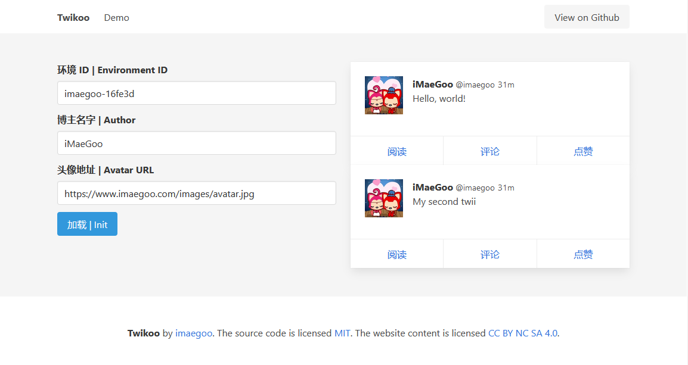

# Twikoo

一个简洁、安全、无后端的静态网站评论系统，基于腾讯云开发。<br>
A simple, safe, serverless comment system based on Tencent CloudBase (tcb).



## 特色 | Features

* 发推 | Send twii
* 评论 | Comment
* 点赞 | Like
* 纯静态 | Static pages
* 可嵌入 | Embedded
* 免费搭建 | Free deploy

## 快速开始 | Quick Start

1. 注册 https://console.cloud.tencent.com/tcb/
2. 初始化数据库
```
npm install
npx tcb login
npx tcb functions:deploy migrate
npx tcb functions:invoke migrate
```

## 贡献者 | Contributors

## 捐赠 | Donate

## 开发 | Development

```
npm install
npm run serve
npm run build
npm run lint
```

## 国际化 | I18N

鉴于腾讯云在中国以外地区的支持程度，本项目暂无国际化计划。

## 许可 | License

[MIT License](./LICENSE)
